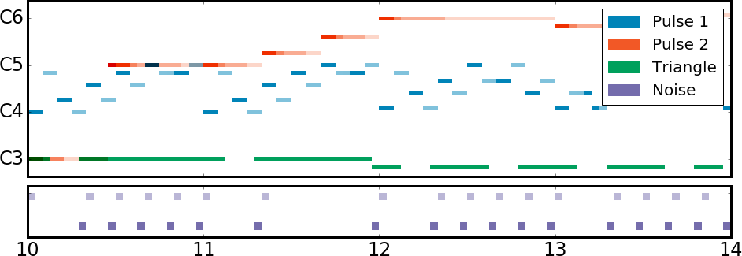
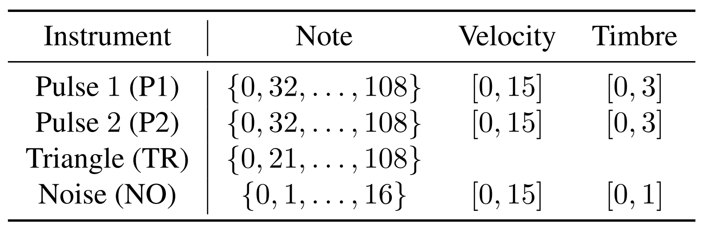
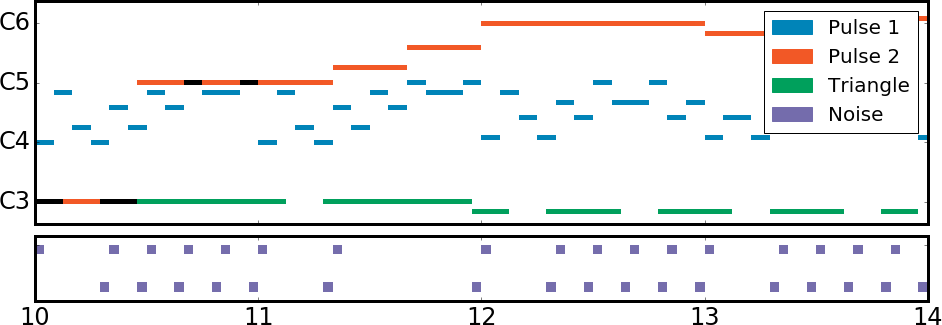
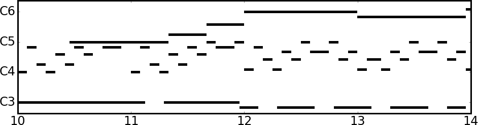

The NES Music Database
======================

- [Dataset information](#dataset-information)
  - [Download links](#download-links)
  - [MIDI format](#midi-format)
  - [Score formats](#score-formats)
  - [Language modeling format](#language-modeling-format)
- [`nesmdb` Python package](#nesmdb-package-information)
  - [Installation](#installation)
  - [Render audio](#rendering-audio)
- [NES synthesizer primer](#nes-synthesizer-primer)
- [Attribution](#attribution)

The Nintendo Entertainment System Music Database (NES-MDB) is a dataset intended for building automatic music composition systems for the NES audio synthesizer ([paper](https://arxiv.org/abs/1806.04278)). The NES synthesizer has highly constrained compositional parameters which are well-suited to a wide variety of current machine learning techniques. The synthesizer is typically programmed in [assembly](https://wiki.nesdev.com/w/index.php/APU), but we parse the assembly into straightforward formats that are more suitable for machine learning.

This repository contains dataset information as well as `nesmdb`, a Python package that can be used to render your generated music through the NES synthesizer. **You only need to [install](#package-installation) the `nesmdb` package if you want to listen to your generated results.** Otherwise, you may simply [download](#download-links) an appropriate format of the dataset.

## Dataset information

The NES-MDB dataset consists of 5278 songs from the soundtracks of 397 NES games. The dataset represents 296 unique composers, and the songs contain more than two million notes combined. We build NES-MDB starting from the assembly code of NES games, which contain the exact timings and parameter values necessary for accurate chiptune renditions. We split the dataset into training, validation, and testing splits, ensuring that no composer appears in multiple splits.

The NES synthesizer has five instrument voices: two pulse-wave generators (`P1`, `P2`), a triangle-wave generator (`TR`), a percussive noise generator (`NO`), and an audio sample playback channel (excluded for simplicity). Each voice is programmed by modifying four 8-bit registers which update the audio synthesis state. With NES-MDB, **our goal is to allow researchers to study NES music while shielding them from the inner workings of an archaic audio synthesis chip**. Hence, we offer the dataset in [several convenient formats](#download-links), and [provide details](#nes-synthesizer-primer) for those who wish to dig deeper.

If your background is in **algorithmic composition**, we recommend using either the [**MIDI**](#midi-format) or [**score**](#score-formats) formats. If you are more familiar with **language modeling**, we recommend the [**NES Language Modeling**](#language-modeling-format) (NLM) format.

### Download links

Hover download links for SHA256 checksums.

- `( 12 MB)` [Download](http://deepyeti.ucsd.edu/cdonahue/nesmdb/nesmdb_midi.tar.gz "37610e2ca5fe70359c85170cf1f4982596783bb304c59d9c439f68c24ff4ee93") NES-MDB in [MIDI Format](#midi-format)
- `( 11 MB)` [Download](http://deepyeti.ucsd.edu/cdonahue/nesmdb/nesmdb24_exprsco.tar.gz "7ca09fdf2be6db5c0767ef6ef7f3f4cac06ae23336c463d123009681b9d64d50") NES-MDB in [Expressive Score Format](#expressive-score)
- `( 04 MB)` [Download](http://deepyeti.ucsd.edu/cdonahue/nesmdb/nesmdb24_seprsco.tar.gz "3e2dadfc0b499cc730a7d2143705215e6cf5abec9e75e6a3e6131f4f9fefeb3a") NES-MDB in [Separated Score Format](#separated-score)
- `( 41 MB)` [Download](http://deepyeti.ucsd.edu/cdonahue/nesmdb/nesmdb24_blndsco.tar.gz "d72027bdbf91fd983963136199c9d60e7b2c6dca8cd461c04bd97ca14425893d") NES-MDB in [Blended Score Format](#blended-score)
- `(155 MB)` [Download](http://deepyeti.ucsd.edu/cdonahue/nesmdb/nesmdb_nlm.tar.gz "5e37a6fe3fa3bb96c93e0d938d89df2767ddfc9d3153b6de6c11f5b9d57bd3a3") NES-MDB in [Language Modeling Format](#language-modeling-format)
- `( 31 MB)` [Download](http://deepyeti.ucsd.edu/cdonahue/nesmdb/nesmdb_vgm.tar.gz "cd44290957cd2dd22a497966f79d24d2a0cdfe135afa83857f25c0871893abc7") NES-MDB in [Raw VGM Format](#raw-format)
- `( 66 KB)` [Download](http://deepyeti.ucsd.edu/cdonahue/nesmdb/nesmdb_meta.pkl "a327a34e64e9809c5cdceed882d5519d99e5cdc9c206a096ccd74975c694af62") NES-MDB Composer Metadata

### MIDI format

The [MIDI](https://en.wikipedia.org/wiki/MIDI#Standard_files) file format stores discrete musical events that describe a composition. MIDI files in NES-MDB consist of note/velocity/timbre events with 44.1 kHz timing resolution, allowing for **sample-accurate reconstruction** by an NES synthesizer.

Each MIDI file consists of four instrument voices: `P1`, `P2`, `TR`, and `NO`. Each voice contains a timestamped list of MIDI note events. All voices except for `TR` contain additional timestamped lists of MIDI control change events representing velocity (`CC11`) and timbre (`CC12`) information. 

[Click here for an IPython notebook exploring the MIDI version of NES-MDB](https://colab.research.google.com/drive/1oN1g4-quvs-2GIDAff8pVOaCh_Dg-cWe)

Example source code for loading an NES-MDB MIDI with [`pretty_midi`](https://github.com/craffel/pretty-midi):

```py
import pretty_midi

midi_data = pretty_midi.PrettyMIDI('train/297_SkyKid_00_01StartMusicBGMIntroBGM.mid')

# If loading MIDI file fails, try
# pretty_midi.pretty_midi.MAX_TICK = 1e10

for instrument in midi_data.instruments:
  print('-' * 80)
  print(instrument.name.upper())
  print('# note events: {}'.format(len(instrument.notes)))
  print('# control change events: {}'.format(len(instrument.control_changes)))
```

### Score formats

The three score formats are [piano roll](https://en.wikipedia.org/wiki/Piano_roll#In_digital_audio_workstations) representations. Unlike the sparse (event-based) MIDI format, the score formats are dense and sampled at a fixed rate of 24 Hz to make them more compact, and are thus lossy.

#### Expressive score

<p align="center"></p>
<p align="center"></p>
<p align="center"><b>Depiction and dimensionality of the expressive score format (all values are discrete).</b></p>

The *expressive score* format contains all of the information that the NES synthesizer needs to render the music at each timestep. Each song is represented as an `numpy.uint8` array of size `Nx4x3`, where `N` is the number of timesteps at 24 Hz. There are `4` synthesis voices, and each has a state of `3` bytes per timestep consisting of note, velocity and timbral information. The above table displays the possible values for each of the instrument voices. The triangle voice only uses note information and will always take value `0` for velocity and timbre.

Example source code for loading an NES-MDB expressive score:

```py
import pickle

with open('train/297_SkyKid_00_01StartMusicBGMIntroBGM.exprsco.pkl', 'rb') as f:
  rate, nsamps, exprsco = pickle.load(f)

print('Temporal discretization rate: {}'.format(rate)) # Will be 24.0
print('Length of original VGM: {}'.format(nsamps / 44100.))
print('Piano roll shape: {}'.format(exprsco.shape))
```

#### Separated score

<p align="center"></p>
<p align="center"><b>Depiction of the separated score format</b></p>

The *separated score* format is the same as the expressive score format except it only contains note information, and thus each song is a `numpy.uint8` array of size `Nx4`. This format is convenient if you wish to only model the notes/timing of the music and not expressive performance characteristics.

```py
import pickle

with open('train/297_SkyKid_00_01StartMusicBGMIntroBGM.seprsco.pkl', 'rb') as f:
  rate, nsamps, seprsco = pickle.load(f)

print('Temporal discretization rate: {}'.format(rate)) # Will be 24.0
print('Length of original VGM: {}'.format(nsamps / 44100.))
print('Piano roll shape: {}'.format(seprsco.shape))
```

#### Blended score

<p align="center"></p>
<p align="center"><b>Depiction of the blended score format</b></p>

The *blended score* format is a degenerate representation where the three melodic voices of the NES synthesizer are flattened into "chords". Each song is represented as a list-of-lists consisting of all the sounding notes at each timestep: e.g. `[[60, 64, 67], [60], [], [62, 69]]`. We offer this format for compatibility with [four other canonical datasets](http://www-etud.iro.umontreal.ca/~boulanni/icml2012) often studied in polyphonic music composition (Boulanger-Lewandowski et al. 2012). As this format loses instrument voice information, **we do not recommend studying it for the purposes of novel NES music generation**.

```py
import pickle

with open('train/297_SkyKid_00_01StartMusicBGMIntroBGM.blndsco.pkl', 'rb') as f:
  rate, nsamps, blndsco = pickle.load(f)

print('Temporal discretization rate: {}'.format(rate)) # Will be 24.0
print('Length of original VGM: {}'.format(nsamps / 44100.))
print('Piano roll length: {}'.format(len(blndsco)))
```

### Language modeling format

The *NES language modeling* (NLM) format is a timestamped list of instructions controlling the synthesizer state machine. Such a list format has less musical structure than MIDI or scores as instructions controlling the four instrument voices are entangled. However, it might be possible to train powerful sequential models to learn the semantics of this format. Here is an annotated example:

```
clock,1789773  # NES system clock rate
fc_mo,0        # Set frame counter to 4-step mode
ch_no,1        # Turn on noise channel
ch_tr,1        # Turn on triangle channel
ch_p2,1        # Turn on Pulse 2 channel
ch_p1,1        # Turn on Pulse 1 channel
w,13           # Wait 13 audio samples (13/44100 seconds)
tr_lr,66       # Set the triangle linear counter load to 66
tr_tl,172      # Set the lower 8 bits of the triangle clock divider to 172
w,1            # Wait 1 audio sample
tr_th,1        # Set the upper 3 bits of the triangle clock divider to 1
```

In the NLM format, the first line is always a `clock` instruction which indicates the frequency of the console clock (NTSC games use `1789772` or `1789773` and PAL games use `1662607`). Each subsequent line consists of either `function,value`, an instruction that updates the synthesis state, or `w,samples`, an instruction that waits for some number of audio samples (at 44.1 kHz) before proceeding.

As an example approach, we created a state space of size 50 consisting of an `<sos>`/`<eos>` token, the 38 [state machine functions](#nes-synthesizer-primer), the wait command, and the digits zero through nine. We then trained a character-level LSTM language model on this representation and used it to generate new sequences. <a href="https://github.com/chrisdonahue/nesmdb/raw/master/static/nlm_generated.mp3">Here are some audio examples</a> (can you do better?)

```py
import pickle

with open('train/297_SkyKid_00_01StartMusicBGMIntroBGM.nlm.pkl', 'rb') as f:
  commands = pickle.load(f)

_, rate = commands[0]
commands = commands[1:]

functions = list(filter(lambda x: x[0] != 'w', commands))
waits = list(filter(lambda x: x[0] == 'w', commands))

print('NES CPU rate: {}'.format(rate))
print('Number of instructions: {}'.format(len(functions)))
print('Length of VGM: {}'.format(sum([x[1] for x in waits]) / 44100.))
```

### Raw format

The aforementioned formats are derived from the [VGM format](http://vgmrips.net/wiki/VGM_Specification). VGM is designed to store timestamped logs of writes to several video game console synthesizers at audio sample rate (44.1 kHz). Version 1.61 added support for the NES synthesizer (this is the only version `nesmdb` currently supports). If you would like to develop your own formats or work with the sample playback channel (which we exclude), we also provide the original VGM files aggregated from [VGMRips](http://vgmrips.net/packs/chip/nes-apu).

## `nesmdb` Package Information

`nesmdb` is a Python 2 (support for Python 3 forthcoming) package which can render your generated music through an emulation of the NES synthesizer. Additionally, it can convert between dataset formats or convert new VGM files into the existing formats.

### Installation

To install `nesmdb`, simply type `pip install nesmdb`. This script will download, compile, and install [VGMPlay](https://github.com/vgmrips/vgmplay) to render NES audio. Currently only tested on Ubuntu 16.04 LTS; please open an issue if build fails.

### Rendering audio

Use the following code to convert an song to a WAV depending on your dataset format. In all cases, the result will be a one-dimensional Numpy array containing the audio samples in floating point at 44.1kHz.

#### MIDI

```py
from nesmdb.convert import midi_to_wav
with open('train/297_SkyKid_00_01StartMusicBGMIntroBGM.mid', 'rb') as f:
  mid = f.read()
# Quantizes MIDI to 100Hz before rendering
# Can set to None to avoid quantization but will take more time/memory
wav = midi_to_wav(mid, midi_to_wav_rate=100)
```

#### Scores (expressive, separated, blended)

```py
import pickle
from nesmdb.convert import exprsco_to_wav
with open('train/297_SkyKid_00_01StartMusicBGMIntroBGM.exprsco.pkl', 'rb') as f:
  exprsco = pickle.load(f)
wav = exprsco_to_wav(exprsco)
```

#### Language modeling

```py
import pickle
from nesmdb.convert import nlm_to_wav
with open('train/297_SkyKid_00_01StartMusicBGMIntroBGM.nlm.pkl', 'rb') as f:
  nlm = pickle.load(f)
wav = nlm_to_wav(nlm)
```

#### VGM

```py
from nesmdb.convert import vgm_to_wav
with open('train/297_SkyKid_00_01StartMusicBGMIntroBGM.vgm', 'rb') as f:
  vgm = f.read()
wav = vgm_to_wav(vgm)
```

#### Batch rendering

Use the following commands to convert a batch of files to WAVs from the command line. If you're converting a single file, you can remove the `--out_dir` argument

- MIDI: `nesmdb_convert midi_to_wav --out_dir wav --midi_to_wav_rate 100 *.mid`
- Expressive score: `nesmdb_convert exprsco_to_wav --out_dir wav *.exprsco.pkl`
- Separated score: `nesmdb_convert seprsco_to_wav --out_dir wav *.seprsco.pkl`
- Blended score: `nesmdb_convert blndsco_to_wav --out_dir wav *.blndsco.pkl`
- Language modeling: `nesmdb_convert nlm_to_wav --out_dir wav *.nlm.pkl`
- VGM: `nesmdb_convert vgm_to_wav --out_dir wav *.vgm`

### Ingesting new VGM files

TODO

### Testing new formats

TODO

## NES Synthesizer Primer

The NES synthesizer has five instrument voices: two pulse-wave generators (`P1`, `P2`), a triangle-wave generator (`TR`), a percussive noise generator (`NO`), and an audio sample playback channel (excluded for simplicity).

Each voice is programmed by modifying four 8-bit registers which update the audio synthesis state. Some of these registers control multiple internal synthesis parameters; a single write to a register may be a partial update of a single parameter or a full change of all parameters. For example, the second register of the pulse generator controls the enabling (1 bit), period (3 bits), negation (1 bit) and shift factor (3 bits) of the frequency sweeper.

The [NLM format](#language-modeling-format) expands register writes into constituent function updates, removing functions that do not change from their last value. Hence, certain functions will *always* appear together in a fixed sequence when the source is a real VGM file. However, when converting from NLM back to VGM, we handle function updates gracefully, so that proper syntax need not be enforced by algorithmic generation methods.

Below is a high-level description of the 38 functions in the NLM format. This is far from a complete picture of the full NES synthesizer state machine. For more information, see [this guide](https://wiki.nesdev.com/w/index.php/APU).

```
| Ch   | Fu   |   Reg |   Max | Description                                                |
|------+------+-------+-------+------------------------------------------------------------|
| p1   | du   |     0 |     3 | Controls waveform duty cycle                               |
| p1   | lh   |     0 |     1 | Enables envelope looping and ignores length counter        |
| p1   | cv   |     0 |     1 | Enables constant volume, otherwise uses envelope volume    |
| p1   | vo   |     0 |    15 | If cv == 0, controls volume, else controls envelope length |
| p1   | se   |     1 |     1 | Enables frequency sweeper                                  |
| p1   | sp   |     1 |     7 | Sets period for frequency sweeper (lower is faster)        |
| p1   | sn   |     1 |     1 | Negates frequency sweeper (pitch increases)                |
| p1   | ss   |     1 |     7 | Shift factor per sweep clock (rate controlled by sp)       |
| p1   | tl   |     2 |   255 | Lower 8 bits of 11-bit timer (controls pitch)              |
| p1   | ll   |     3 |    31 | Length counter value (controls note length)                |
| p1   | th   |     3 |     7 | Upper 3 bits of 11-bit timer (controls pitch)              |
|      |      |       |       |                                                            |
| p2   | du   |     0 |     3 | Controls waveform duty cycle                               |
| p2   | lh   |     0 |     1 | Enables envelope looping and ignores length counter        |
| p2   | cv   |     0 |     1 | Enables constant volume, otherwise uses envelope volume    |
| p2   | vo   |     0 |    15 | If cv == 0, controls volume, else controls envelope length |
| p2   | se   |     1 |     1 | Enables frequency sweeper                                  |
| p2   | sp   |     1 |     7 | Sets period for frequency sweeper (lower is faster)        |
| p2   | sn   |     1 |     1 | Negates frequency sweeper (pitch increases)                |
| p2   | ss   |     1 |     7 | Shift factor per sweep clock (rate controlled by sp)       |
| p2   | tl   |     2 |   255 | Lower 8 bits of 11-bit timer (controls pitch)              |
| p2   | ll   |     3 |    31 | Length counter value (controls note length)                |
| p2   | th   |     3 |     7 | Upper 3 bits of 11-bit timer (controls pitch)              |
|      |      |       |       |                                                            |
| tr   | lh   |     0 |     1 | Enables envelope looping and ignores length counter        |
| tr   | lr   |     0 |   127 | High-precision length counter value (controls note length) |
| tr   | tl   |     2 |   255 | Lower 8 bits of 11-bit timer (controls pitch)              |
| tr   | ll   |     3 |    31 | Length counter value (controls note length)                |
| tr   | th   |     3 |     7 | Upper 3 bits of 11-bit timer (controls pitch)              |
|      |      |       |       |                                                            |
| no   | lh   |     0 |     1 | Enables envelope looping and ignores length counter        |
| no   | cv   |     0 |     1 | Enables constant volume, otherwise uses envelope volume    |
| no   | vo   |     0 |    15 | If cv == 0, controls volume, else controls envelope length |
| no   | nl   |     2 |     1 | Enables (rare) noise looping mode, causing pitched tones   |
| no   | np   |     2 |    15 | Sets period (roughly determines frequency) of noise        |
| no   | ll   |     3 |    31 | Length counter value (controls note length)                |
|      |      |       |       |                                                            |
| ch   | no   |     0 |     1 | Enables Noise channel                                      |
| ch   | tr   |     0 |     1 | Enables Triangle channel                                   |
| ch   | p2   |     0 |     1 | Enables Pulse 2 channel                                    |
| ch   | p1   |     0 |     1 | Enables Pulse 1 channel                                    |
|      |      |       |       |                                                            |
| fc   | mo   |     0 |     1 | If mo == 0, frame counter is full speed, else 4/5 speed    |
```

## Attribution

If you use this dataset or code in your research, cite [our paper](https://arxiv.org/abs/1806.04278) via the following BibTeX

```
@inproceedings{donahue2018nesmdb,
  title={The NES Music Database: A multi-instrumental dataset with expressive performance attributes},
  author={Donahue, Chris and Mao, Huanru Henry and McAuley, Julian},
  booktitle={ISMIR},
  year={2018}
}
```
